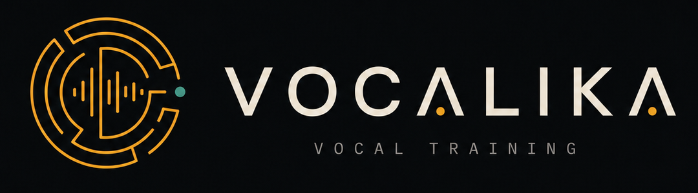

<p align="center">
  
</p>

<p align="center"><strong>Sing it. Measure it. Close the gap.</strong></p>

<p align="center">
  Vocal training against the songs you actually want to sing —<br />
  pitch and timing feedback in cents and milliseconds, not stars and applause.
</p>

---

Vocalika takes any song, pulls the voice out of the mix, and turns it into a
reference you can practise against. Sing a take, and it lays your pitch over
the original, frame by frame and note by note, and shows exactly where you
went flat, where you rushed, and by how much.

Everything runs on your own machine. Your recordings never leave it.

## The workflow

Each song is a **project**: create one from a local audio file or a YouTube
link, and Vocalika separates the vocal from the instrumental once and keeps
both stems for everything that follows.

**01 · Reference** — Listen to the isolated vocal, the instrumental, or a
monitor mix with the voice turned as low as you like. Trim to the section you
are working on, and transpose the song into your key; Vocalika shows the range
it will ask of you before you sing a note. Lyrics are looked up for you and
timed word by word to the original vocal: the sung line lights up as the song
plays, and any line or word plays the song from right there.

**02 · Practice** — Exercises drawn from the song itself: its range, its long
held notes, and its leaps, played on a sampled grand piano and scored as you
sing them.

**03 · Takes** — Record straight from the browser, with the timed lyrics
following along and a live pitch ribbon tracing your voice against the
reference as you sing. Or upload a take recorded elsewhere — even a full mix
with instruments, which Vocalika isolates first.

**04 · Compare** — Your contour over the original, in cents, with note names
alongside. Held notes are measured on their centre, so a scoop into a note is
not confused with singing it out of tune. Zoom into a phrase and the metrics
follow the selection; listen back with a playhead running across every chart.

**05 · Export** — Your take, placed on the original timeline and mixed with the
instrumental at the level you choose, as MP3, WAV or FLAC — centred over the
reference, or split hard left and right so you can hear the two voices apart.

## Getting started

Vocalika runs on macOS (Apple Silicon) with Python 3.12,
[`uv`](https://docs.astral.sh/uv/), Node.js, and ffmpeg.

```bash
uv sync --extra real-input
npm --prefix frontend install
npm --prefix frontend run build
uv run vocalika setup-models
uv run vocalika serve
```

Then open <http://127.0.0.1:8000>.

`setup-models` downloads the source-separation and lyric-alignment models
once, up front, so the first project does not stall on them. Projects live in
`analysis-output/projects/`; your original audio files are never modified.

To reach Vocalika from another computer on a trusted network, bind it to all
interfaces:

```bash
uv run vocalika serve --host 0.0.0.0
```

There is no authentication, so keep it off the public internet.

## How it listens

**Separation.** [Demucs](https://github.com/facebookresearch/demucs)
(`htdemucs`) splits the reference into vocal and instrumental stems.

**Pitch.** pYIN, run on a harmonic-only version of each vocal, tracks pitch
continuously and reports how confident it is in every frame. Only frames where
both voices are confidently singing are compared.

**Alignment.** Before comparing pitch, Vocalika finds where your take sits in
the song — by direct correlation, by matching the shape of the words, and by
the vocal energy envelope — so a take that starts mid-song, or skips the
second verse, is paired with the right phrase. Dynamic time warping then lines
the two contours up note against note.

**Lyrics.** Lyrics come from [LRCLIB](https://lrclib.net), an open lyrics
database, or are pasted in by hand, and are timed against the isolated vocal
with Meta's multilingual MMS forced aligner. The words are already known, so
the model only has to place them in time — far more reliable on singing than
transcribing it. On ten test songs it put nearly nine lines in ten within a
second of hand-made timestamps, in about fifteen seconds per song.

**Metrics.** Two error families, each in absolute terms and with an overall
key shift factored out:

- **Contour error** compares every confident aligned frame — transitions,
  scoops and vibrato included.
- **Stable-note error** compares the centres of the notes you hold, and
  reports how many notes and how many seconds it rests on, so a score built on
  three notes is never mistaken for one built on thirty.

Every analysis is written to a self-describing JSON artifact beside its
working audio, so it can be reopened, plotted, or inspected later.

## Command line

The analysis pipeline also runs without the web interface:

```bash
uv run vocalika analyze \
  --reference "https://www.youtube.com/watch?v=..." \
  --performance ./my-take.flac \
  --isolate-performance \
  --output ./analysis-output

uv run vocalika plot ./analysis-output/analysis.json
```

Pass `--reference-is-vocal` (with `--reference-mix` for listening) when the
reference is already an isolated vocal. Downloads, stems, pitch tracks and
lyric timings are cached by content; `vocalika cache-path` shows where, and
`vocalika cache-clear` empties it.

## Development

```bash
uv sync --extra dev --extra real-input
uv run ruff check src tests
uv run ruff format --check src tests
uv run mypy
uv run pytest
npm --prefix frontend test
npm --prefix frontend run build
```

Pitch accuracy is also checked against the Vocadito and MAST melody open
datasets; see [Open test datasets](docs/OPEN_DATASETS.md). The design is
described in the [product requirements](docs/PRD-001-MVP.md) and the
[feature architecture](docs/FEATURE_ARCHITECTURE.md).

## License

[MIT](LICENSE)
